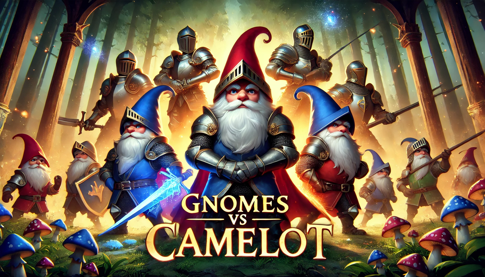

# **Gnomes vs Camelot**  

**Gnomes vs Camelot** is a **lane-based tower defense game** inspired by *Plants vs. Zombies*. Built-in **Unity 6**, this game brings a fresh fantasy twist where **gnomes** defend their enchanted forest against invading **knights of Camelot** in strategic, wave-based battles.  

🛠 **Platform:** **Android**  

---

## 📖 **Storyline**  
In the mystical land of **Elderglen**, the **gnomes** have lived peacefully for centuries, guarding the sacred **Tree of Everlight**, the source of all magic.  

But peace is shattered when the legendary **Knights of Camelot**, led by the ruthless **King Albrecht**, invade, seeking to claim the tree’s power for themselves.  

Now, the gnomes must use their **wit, magic, and nature’s defenses** to **hold the line**. If the knights reach the Everlight, magic will be lost forever!  

---

## 🎮 **Game Features**  

✅ **Classic Lane-Based Strategy** – Inspired by *Plants vs. Zombies*, with a unique fantasy setting.  
✅ **Tactical Gnome Defenders** – Deploy various gnomes with unique abilities to protect your land.  
✅ **Challenging Enemy Waves** – Face a variety of knights, including:  
   - **Camelot Foot Soldiers** – Standard knights marching forward.  
   - **Shield Bearers** – Defenders that block projectiles.  
   - **Siege Engineers** – Launching boulders at gnome defenses.  
   - **Mage Knights** – Casting spells to disrupt your formation.  
✅ **Dynamic Abilities & Magic** – Summon **lightning strikes, healing fountains, and enchanted defenses** to aid your forces.  
✅ **Beautiful Fantasy World** – Vibrant visuals, magical forests, and detailed character animations.  
✅ **Smooth Mobile Experience** – Intuitive **touch controls** and optimized performance for **Android devices**.  

---

## 📜 **How to Play**  

1️⃣ **Start a new game** from the main menu.  
2️⃣ **Drag & drop** gnome defenders onto lanes to set up your defense.  
3️⃣ **Strategically place units** and **use special abilities** to fend off incoming knights.  
4️⃣ **Collect resources** to summon stronger defenders and upgrade your forces.  
5️⃣ **Survive all waves** to claim victory and unlock new levels!  

---

## 🛠️ **Installation Guide**  

### **For Android Users:**  
1. **Download the APK** from the official release.  
2. Enable **Unknown Sources** in your device settings.  
3. Install the APK and start playing!  

---

## 📢 **Follow for Updates!**  

Stay tuned for **new content, updates, and exclusive features!**  
