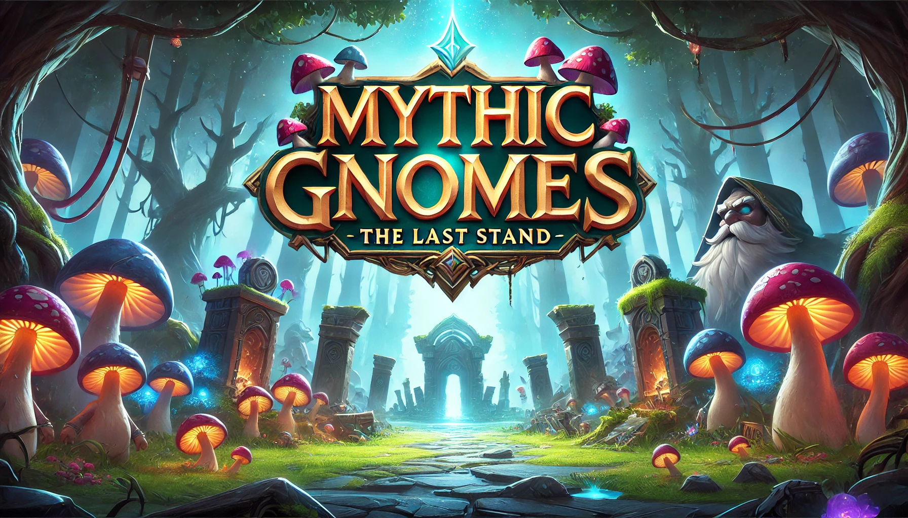

# **Mythic Gnomes: The Last Stand**  

**Mythic Gnomes: The Last Stand** is a **lane-based tower defense game** inspired by the hit mobile game *Plants vs. Zombies*. Built in **Unity 6**, this game brings a fresh fantasy twist, where **gnomes** defend their enchanted forest against invading **knights** in strategic, wave-based battles.  

🛠 **Developed for:** **Android devices**  

  

---  

## 📖 **Storyline**  
In the mystical land of **Elderglen**, the **gnomes** have lived peacefully for centuries, guarding the **Tree of Everlight**, the source of all magic in the realm. However, their peace is shattered when the ruthless **King Albrecht** and his **Ironclad Knights** invade, seeking to claim the tree’s power for themselves.  

With their home under siege, the gnomes must use their wits, magic, and nature’s defenses to **hold the line**. If the knights reach the Everlight, all magic will be lost forever!  

---  

## 🎮 **Features**  

✅ **Inspired by *Plants vs. Zombies*** – Classic lane-based strategy with a fresh fantasy setting.  
✅ **Lane-Based Tower Defense** – Position gnome defenders across different lanes to stop incoming waves of knights.  
✅ **Unique Gnome Units** – Choose from a variety of defenders!
   
   - **Enchanted Druids** – Spellcasters that summon roots to entangle enemies.  
✅ **Progressive Enemy Waves** – Face knights of all kinds, from basic foot soldiers to armored brutes and siege weapons.  
✅ **Fantasy-Themed World** – Vibrant visuals, magical forests, and detailed character animations.  
✅ **Powerful Gnome Abilities** – Summon lightning strikes, healing fountains, and enchanted defenses to turn the tide.  
✅ **Optimized for Mobile** – Designed with **intuitive touch controls** and smooth performance for Android devices.  

---  

## 📜 **How to Play**  

1️⃣ **Start a new game** from the main menu.  
2️⃣ **Drag and drop** gnome defenders onto lanes to create your defense.  
3️⃣ **Defend against waves** of knights, strategically placing units and using special abilities.  
4️⃣ **Collect resources** to summon stronger defenders and upgrade your forces.  
5️⃣ **Survive and win!** Defeat all waves to advance and unlock new levels.  

---  

## 🛠️ **Installation**  

### **Android**  
1. Download the APK from the official source (**Github Release on the right-->**).  
2. Enable **Unknown Sources** in your device settings.  
3. Install the APK and start playing.  

---

**Follow for Updates!**  
📢 Stay tuned for new features, updates, and upcoming content.  
