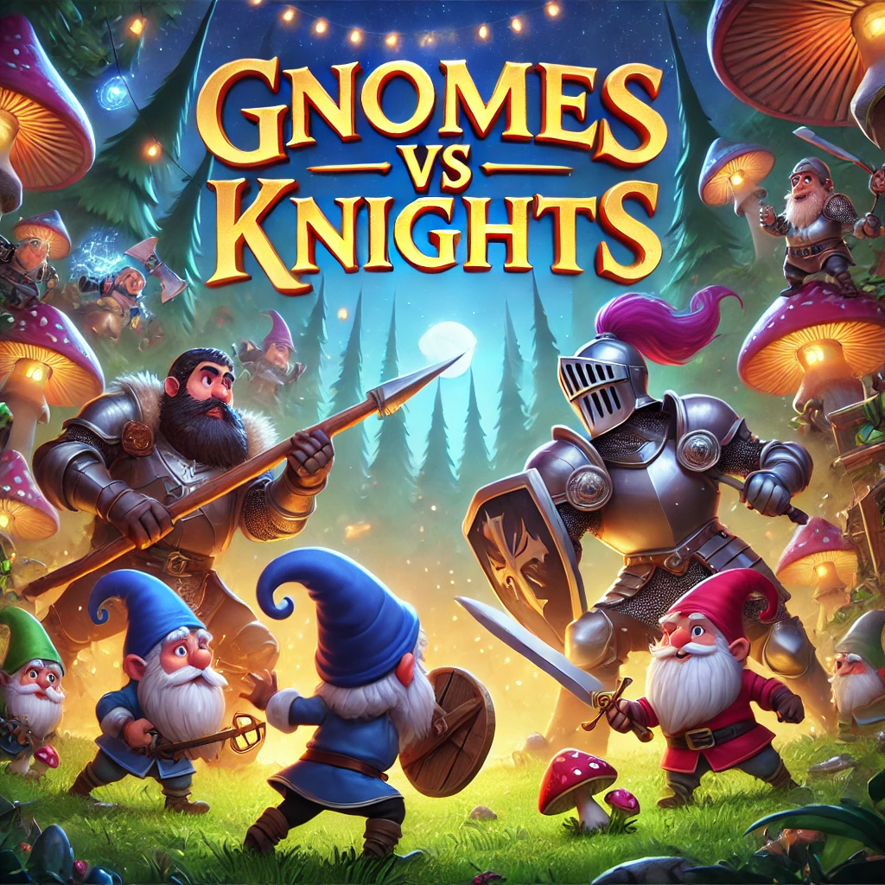

# Gnomes vs Knights

**Gnomes vs Knights** is a **lane-based tower defense game** built in **Unity 6**, where **gnomes** defend their enchanted forest against invading **knights**.

🛠 **Developed for:** **Android devices**  

---

## 📖 Storyline
In the mystical land of **Elderglen**, the **gnomes** have lived in harmony, protecting the **Tree of Everlight**, the source of all magic. But peace is shattered when the **Ironclad Knights**, led by the ruthless **King Albrecht**, invade the forest, seeking to claim its power. Now, the gnomes must use their magic, trickery, and nature’s defenses to stop the knights before they seize control of the Everlight!

---

## 🎮 Features
- **Lane-Based Tower Defense** – Strategically place gnome defenders to stop waves of knights.  
- **Unique Gnome Units** – Shooters, blockers, bombers, and more.  
- **Progressive Enemy Waves** – Different types of knights with increasing difficulty.  
- **Fantasy-Themed World** – Explore a magical forest setting with vibrant visuals.  
- **Optimized for Android** – Designed to run smoothly using **touch controls**.  

---

## 📜 How to Play
1. **Start a new game** from the main menu.  
2. **Place gnome defenders** strategically on the grid to defend your forest home.  
3. **Defend against waves** of knights who are trying to take over the gnomes' magical forest.  
4. **Survive and win!** Earn rewards and unlock more units.  

---

## 🛠️ Installation

### **Android**
1. Download the APK from the official source (**TBD**).  
2. Enable **Unknown Sources** in your device settings.  
3. Install the APK and start playing.  
